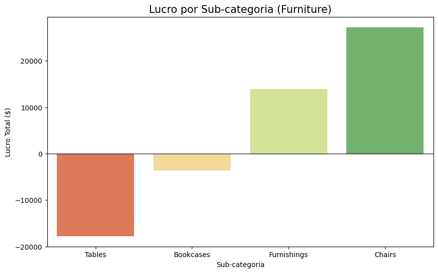
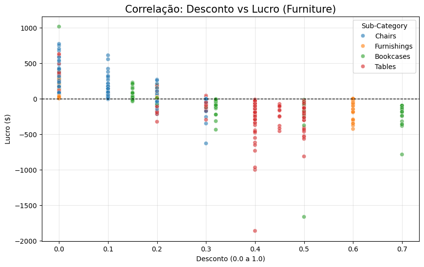

# 📊 Data Case: Diagnóstico de Lucratividade no Varejo

## 🎯 Objetivo

Investigar a erosão de margem na categoria de **Móveis (Furniture)** e identificar os fatores operacionais que estão gerando prejuízo líquido — combinando SQL para extração e agregação com Python para análise estatística e visualização.

## 🛠️ Stack Utilizada

- **SQL (SQLite):** Extração, agregação e cruzamento de dados por categoria, região e modo de envio.
  
- **Python (Pandas, Seaborn, Matplotlib):** Análise exploratória e visualização.
  
- **Dataset:** [Sample - Superstore](https://www.kaggle.com/datasets/vivek468/superstore-dataset-final) — dataset público amplamente utilizado em projetos de análise de varejo.
    
## 📁 Estrutura do Repositório

```
analise-varejo-sql/
├── data/                        # Dataset original (.csv)
├── sql_query/                   # Queries SQL organizadas por análise
│   ├── lucro_total_categoria.sql
│   ├── lucro_subcategoria_furniture.sql
│   ├── regiao_subcategoria_furniture.sql
│   └── ship_mode_subcategoria_furniture.sql
├── notebooks/                   # Análise exploratória em Python
│   └── sample_-_superstore.ipynb
└── img/                         # Gráficos gerados
```

## 🔎 Análise Exploratória (Insights Principais)

### 1. O Cenário de Prejuízo

Através do SQL, identificamos que **Tables** e **Bookcases** são os principais detratores de lucro. O gráfico abaixo, gerado em Python, mostra a disparidade entre as subcategorias:

O gráfico usa escala de cor semáforo: vermelho indica prejuízo, verde indica lucro — quanto mais intenso, maior a magnitude:



### 2. A Causa Raiz: Política de Descontos

Ao cruzar o lucro com o nível de desconto aplicado, observamos uma correlação negativa clara.

- **Correlação de Pearson**: r = -0.478 | p < 0.001 — estatisticamente significativo.
  
- Regressão linear: cada 10% de desconto reduz o lucro esperado em aproximadamente $38.

- **Insight:** Vendas com descontos acima de 20% raramente atingem o breakeven (ponto de equilíbrio).
    



### 3. Logística e Região Central

- A **Região Central** apresenta prejuízo devido ao desconto médio elevado (30%).
    
- O modo de envio **Standard Class** se mostrou ineficiente para produtos pesados nesta categoria.
    

## 💡 Recomendações

1. Limitar descontos em móveis a no máximo 15% - acima disso, o lucro operacional é consistentemente negativo.
    
2. Revisar a precificação logística para itens de grande porte na Região Central.
